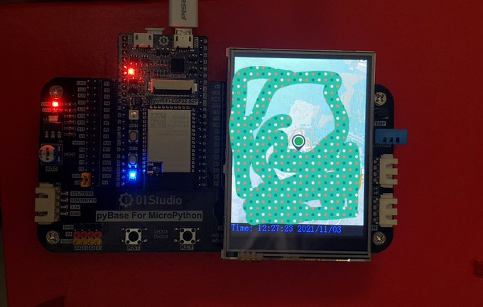

# ESP32-S2-Live-GNSS

用GPS和北斗模塊在地圖上實時顯示位置、時間和日期。使用https://developer.mapquest.com/documentation/static-map-api/v5/的靜態地圖API.

Using a GNSS module (Beidou + GPS) and the mapquest static map API, it displays live location on a MapQuest-generated map. MicroPython code, WIP.

